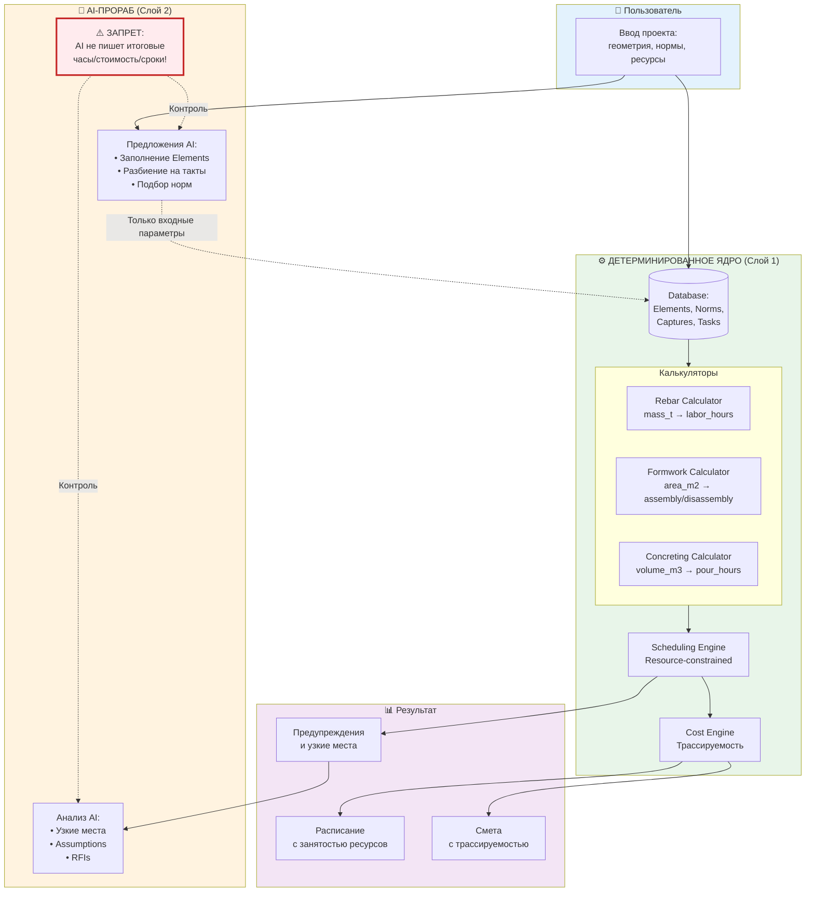

# Monolit-Planner Architecture R0: Детерминированное Ядро

**Version:** R0 (MVP - Minimum Viable Product)
**Date:** 2026-01-20
**Status:** 🟡 In Development

---

## 🎯 Философия

> **"AI предлагает параметры, Ядро считает цифры"**

### Ключевые принципы

1. **Детерминированность** - Одни входные данные → всегда одинаковый результат
2. **Трассируемость** - Каждый результат содержит `source_tag`, `confidence`, `assumptions_log`
3. **Разделение ответственности**:
   - ✅ AI может: предлагать геометрию, нормы, разбиение на такты
   - ❌ AI не может: писать итоговые часы/стоимость/сроки
4. **Валидация** - Движок выявляет узкие места и ошибки (такт > смены, нехватка ресурсов)

---

## 🏗️ Архитектура системы



---

## 📊 Модель данных

### 1. Projects (Проекты)

Верхний уровень - параметры всего проекта.

| Поле | Тип | Описание | Пример |
|------|-----|----------|--------|
| `id` | TEXT | UUID проекта | `"proj_123"` |
| `name` | TEXT | Название | `"Most přes Biokoridor"` |
| `shift_hours` | REAL | Продолжительность смены | `10.0` |
| `time_utilization_k` | REAL | Коэффициент использования времени | `0.80` (80%) |
| `oh_rate` | REAL | Накладные расходы | `0.13` (13%) |
| `profit_rate` | REAL | Прибыль | `0.08` (8%) |
| `reserve_rate` | REAL | Резерв | `0.05` (5%) |

### 2. Elements (Физические элементы конструкции)

Представляют части конструкции: плиты, стены, балки, фундаменты, колонны.

| Поле | Тип | Описание | Пример |
|------|-----|----------|--------|
| `id` | TEXT | UUID элемента | `"elem_slab_01"` |
| `project_id` | TEXT | FK → projects | `"proj_123"` |
| `type` | TEXT | Тип элемента | `"slab"` / `"wall"` / `"beam"` |
| `name` | TEXT | Название | `"Deska nad 1. NP"` |
| **Геометрия** | | | |
| `length_m` | REAL | Длина (м) | `20.5` |
| `width_m` | REAL | Ширина (м) | `8.0` |
| `height_m` | REAL | Высота (м) | `3.5` |
| `thickness_m` | REAL | Толщина (м) | `0.25` |
| **Количества** | | | |
| `concrete_volume_m3` | REAL | Объём бетона (м³) | `41.0` |
| `formwork_area_m2` | REAL | Площадь опалубки (м²) | `164.0` |
| `rebar_mass_t` | REAL | Масса арматуры (т) | `4.1` |
| **Ограничения** | | | |
| `max_continuous_pour_hours` | REAL | Макс. окно непрерывности (ч) | `12.0` |
| `layer_thickness_m` | REAL | Толщина слоя при послойном (м) | `0.5` |

**Типы элементов:**
- `slab` - плита (горизонтальная)
- `wall` - стена (вертикальная)
- `beam` - балка (линейный элемент)
- `footing` - фундамент
- `column` - колонна

### 3. NormSets (Библиотека норм)

Наборы нормативов из разных источников.

| Поле | Тип | Описание | Пример |
|------|-----|----------|--------|
| `id` | TEXT | UUID набора норм | `"norm_urs_2024"` |
| `name` | TEXT | Название | `"ÚRS 2024"` |
| `source_tag` | TEXT | Источник (для трассируемости) | `"URS_2024_OFFICIAL"` |
| **Нормы на арматуру** | | | |
| `rebar_h_per_t` | REAL | Часов на 1 тонну | `50.0` |
| **Нормы на опалубку** | | | |
| `formwork_assembly_h_per_m2` | REAL | Монтаж часов/м² | `0.8` |
| `formwork_disassembly_h_per_m2` | REAL | Демонтаж часов/м² | `0.3` |
| **Нормы на бетонирование** | | | |
| `pour_team_required` | INTEGER | Размер бригады | `6` |
| `pour_setup_hours` | REAL | Подготовка (ч) | `0.5` |
| `washout_hours` | REAL | Промывка (ч) | `0.5` |
| `strip_wait_hours` | REAL | Выдержка до распалубки (ч) | `72.0` (3 суток) |

**Источники норм:**
- `URS_2024_OFFICIAL` - Официальные нормы ÚRS 2024
- `RTS_2023` - Российские ТСН
- `KROS_2024` - Чешские нормы KROS
- `INTERNAL_MEASURED` - Измеренные на проектах компании
- `AI_PROPOSED` - Предложено AI (требует валидации)

### 4. Captures (Захватки/Такты)

Разбиение элементов на части для поэтапного строительства.

| Поле | Тип | Описание | Пример |
|------|-----|----------|--------|
| `id` | TEXT | UUID захватки | `"capt_01"` |
| `element_id` | TEXT | FK → elements | `"elem_slab_01"` |
| `sequence_index` | INTEGER | Порядковый номер | `1` (первая захватка) |
| **Количества захватки** | | | |
| `volume_m3` | REAL | Объём бетона (м³) | `20.5` |
| `area_m2` | REAL | Площадь опалубки (м²) | `82.0` |
| `mass_t` | REAL | Масса арматуры (т) | `2.05` |
| **Метаданные** | | | |
| `joint_type` | TEXT | Тип стыка | `"construction_joint"` |
| `dependencies` | TEXT | JSON массив predecessor ID | `["capt_00"]` |

**Типы стыков:**
- `none` - нет стыка (единый массив)
- `construction_joint` - рабочий шов
- `expansion_joint` - деформационный шов

**Зависимости (dependencies):**
Массив ID предыдущих захваток, которые должны завершиться до начала текущей.

```json
{
  "dependencies": ["capt_00", "capt_01"]
}
```

### 5. Tasks (Операции)

Автогенерируемые задачи для каждой захватки.

| Поле | Тип | Описание | Пример |
|------|-----|----------|--------|
| `id` | TEXT | UUID задачи | `"task_rebar_01"` |
| `capture_id` | TEXT | FK → captures | `"capt_01"` |
| `type` | TEXT | Тип операции | `"rebar"` |
| `sequence` | INTEGER | Порядок в захватке | `1` |
| **Расчётные поля (детерминированные!)** | | | |
| `duration_hours` | REAL | Длительность (ч) | `102.5` |
| `labor_hours` | REAL | Трудозатраты (ч) | `102.5` |
| `cost_labor` | REAL | Стоимость труда (CZK) | `40,795` |
| `cost_machine` | REAL | Стоимость механизмов (CZK) | `5,000` |
| **Трассируемость** | | | |
| `source_tag` | TEXT | Источник нормы | `"URS_2024_OFFICIAL"` |
| `confidence` | REAL | Уверенность (0-1) | `0.95` |
| `assumptions_log` | TEXT | Допущения | `"norm=50 h/t, crew=4, k=0.8"` |

**Типы операций (type):**
1. `rebar` - вязка арматуры
2. `formwork_in` - монтаж опалубки
3. `pour` - бетонирование
4. `wait_strip` - выдержка до распалубки (технологическая пауза)
5. `formwork_out` - демонтаж опалубки
6. `move_clean` - перестановка и очистка комплектов

**Типичная последовательность операций для одной захватки:**
```
1. rebar (sequence=1)
2. formwork_in (sequence=2)
3. pour (sequence=3)
4. wait_strip (sequence=4) ← технологическая пауза 72ч
5. formwork_out (sequence=5)
6. move_clean (sequence=6)
```

### 6. Schedule (Расписание)

Результат работы Scheduling Engine - календарный план с ресурсами.

| Поле | Тип | Описание | Пример |
|------|-----|----------|--------|
| `task_id` | TEXT | FK → tasks | `"task_rebar_01"` |
| `start_day` | REAL | День начала | `5.0` |
| `end_day` | REAL | День окончания | `6.28` |
| `resources_used` | TEXT | JSON с ресурсами | `{"crew_id": "crew_A", "kit_id": "k1"}` |

**Пример resources_used JSON:**
```json
{
  "crew_id": "crew_rebar_01",
  "crew_size": 4,
  "kit_id": "formwork_kit_A",
  "pump_id": "pump_01"
}
```

---

## ⚙️ Калькуляторы (Детерминированные функции)

### 1. Rebar Calculator

**Входные параметры:**
```typescript
interface RebarCalculatorParams {
  mass_t: number;               // Масса арматуры (т)
  norm_h_per_t: number;         // Норма часов на 1 тонну
  crew_size: number;            // Размер бригады
  shift_h: number;              // Длительность смены (ч)
  k: number;                    // Коэффициент использования времени
  wage_czk_h: number;           // Ставка (CZK/ч)
  source_tag?: string;          // Источник нормы
  confidence?: number;          // Уверенность (0-1)
}
```

**Формулы:**
```
labor_hours = mass_t × norm_h_per_t
duration_days = labor_hours / (crew_size × shift_h × k)
cost_labor = labor_hours × wage_czk_h
```

**Выходные данные:**
```typescript
interface RebarCalculatorResult {
  labor_hours: number;          // Трудозатраты (ч)
  duration_days: number;        // Длительность (дни)
  cost_labor: number;           // Стоимость труда (CZK)

  // Трассируемость
  source_tag: string;           // "URS_2024_OFFICIAL"
  assumptions_log: string;      // "norm=50 h/t, crew=4, k=0.8"
  confidence: number;           // 0.95
}
```

**Пример расчёта:**
```
Дано: 2.05т арматуры, норма 50ч/т, бригада 4 чел, смена 10ч, k=0.8, ставка 398 CZK/ч

labor_hours = 2.05 × 50 = 102.5 ч
duration_days = 102.5 / (4 × 10 × 0.8) = 3.20 дня
cost_labor = 102.5 × 398 = 40,795 CZK
```

---

### 2. Formwork Calculator

**Входные параметры:**
```typescript
interface FormworkCalculatorParams {
  area_m2: number;              // Площадь опалубки (м²)
  norm_assembly_h_m2: number;   // Норма монтажа (ч/м²)
  norm_disassembly_h_m2: number; // Норма демонтажа (ч/м²)
  crew_size: number;            // Размер бригады
  shift_h: number;              // Длительность смены (ч)
  k: number;                    // Коэффициент использования времени
  wage_czk_h: number;           // Ставка (CZK/ч)

  // Технологические параметры
  strip_wait_hours: number;     // Выдержка до распалубки (ч)
  move_clean_hours: number;     // Перестановка и очистка (ч)

  // Ресурсы
  kits_count: number;           // Количество комплектов опалубки
  rental_czk_day: number;       // Аренда комплекта (CZK/день)

  source_tag?: string;
  confidence?: number;
}
```

**Формулы:**
```
assembly_hours = area_m2 × norm_assembly_h_m2
disassembly_hours = area_m2 × norm_disassembly_h_m2

assembly_days = assembly_hours / (crew_size × shift_h × k)
disassembly_days = disassembly_hours / (crew_size × shift_h × k)
wait_days = strip_wait_hours / shift_h

kit_occupancy_days = assembly_days + wait_days + disassembly_days + (move_clean_hours / shift_h)
```

**Выходные данные:**
```typescript
interface FormworkCalculatorResult {
  assembly_hours: number;       // Монтаж (ч)
  disassembly_hours: number;    // Демонтаж (ч)
  assembly_days: number;        // Монтаж (дни)
  disassembly_days: number;     // Демонтаж (дни)
  kit_occupancy_days: number;   // Занятость комплекта (дни)

  cost_labor: number;           // Стоимость труда (CZK)
  // ВАЖНО: cost_rental считается в Schedule Engine на основе календаря!

  source_tag: string;
  assumptions_log: string;
  confidence: number;
}
```

**Пример расчёта:**
```
Дано: 82м² опалубки, норма монтаж 0.8ч/м², демонтаж 0.3ч/м², бригада 4 чел,
      смена 10ч, k=0.8, ставка 398 CZK/ч, выдержка 72ч, перестановка 2ч

assembly_hours = 82 × 0.8 = 65.6 ч
disassembly_hours = 82 × 0.3 = 24.6 ч

assembly_days = 65.6 / (4 × 10 × 0.8) = 2.05 дня
disassembly_days = 24.6 / (4 × 10 × 0.8) = 0.77 дня
wait_days = 72 / 10 = 7.2 дня

kit_occupancy_days = 2.05 + 7.2 + 0.77 + (2 / 10) = 10.22 дня

cost_labor = (65.6 + 24.6) × 398 = 35,900 CZK
```

---

### 3. Concreting (Pump) Calculator

**Входные параметры:**
```typescript
interface ConcretingCalculatorParams {
  volume_m3: number;            // Объём бетона (м³)
  q_eff_m3_h: number;           // Эффективная производительность насоса (м³/ч)
  setup_hours: number;          // Подготовка (ч)
  washout_hours: number;        // Промывка (ч)
  crew_size: number;            // Размер бригады
  shift_h: number;              // Длительность смены (ч)
  wage_czk_h: number;           // Ставка (CZK/ч)
  pump_rate_czk_h: number;      // Стоимость насоса (CZK/ч)

  // Ограничения
  max_continuous_hours: number; // Макс. окно непрерывности (ч)

  source_tag?: string;
  confidence?: number;
}
```

**Формулы:**
```
pour_hours = setup_hours + (volume_m3 / q_eff_m3_h) + washout_hours
pour_days = pour_hours / shift_h

cost_labor = pour_hours × crew_size × wage_czk_h
cost_pump = pour_hours × pump_rate_czk_h

// ВАЛИДАЦИЯ
exceeds_continuous = pour_hours > max_continuous_hours
```

**Выходные данные:**
```typescript
interface ConcretingCalculatorResult {
  pour_hours: number;           // Время бетонирования (ч)
  pour_days: number;            // Длительность (дни)
  cost_labor: number;           // Стоимость труда (CZK)
  cost_pump: number;            // Стоимость насоса (CZK)

  // Валидация
  exceeds_continuous_window: boolean; // true если превышено окно
  warning: string | null;       // Предупреждение или null

  source_tag: string;
  assumptions_log: string;
  confidence: number;
}
```

**Пример расчёта:**
```
Дано: 20.5м³ бетона, Q_eff=15м³/ч, подготовка 0.5ч, промывка 0.5ч,
      бригада 6 чел, смена 10ч, ставка 398 CZK/ч, насос 1500 CZK/ч,
      макс. окно 12ч

pour_hours = 0.5 + (20.5 / 15) + 0.5 = 2.37 ч
pour_days = 2.37 / 10 = 0.24 дня

cost_labor = 2.37 × 6 × 398 = 5,659 CZK
cost_pump = 2.37 × 1500 = 3,555 CZK

exceeds_continuous = 2.37 > 12 → false ✅
warning = null
```

---

## 🗓️ Scheduling Engine

### Алгоритм: Serial Resource-Constrained Scheduling

**Входные данные:**
- Список задач (tasks) с длительностями и зависимостями
- Доступные ресурсы (бригады, комплекты опалубки, насос)
- Календарь (рабочие/нерабочие дни)

**Алгоритм:**

1. **Топологическая сортировка** задач по зависимостям (predecessors)
2. Для каждой задачи:
   - Вычислить `earliest_start` = max(finish predecessors, resource availability)
   - Проверить доступность требуемых ресурсов
   - Назначить задачу на `earliest_start`
   - Обновить занятость ресурсов
3. Вычислить критический путь (Critical Path)
4. Определить узкие места (bottlenecks)

**Псевдокод:**

```typescript
function scheduleProject(tasks: Task[], resources: Resources, calendar: Calendar): Schedule[] {
  const schedule: Schedule[] = [];
  const resourceAvailability: Map<string, Availability> = new Map();

  // 1. Топологическая сортировка
  const sortedTasks = topologicalSort(tasks);

  for (const task of sortedTasks) {
    // 2. Earliest start = max(predecessors finish, resource available)
    let earliestStart = 0;

    // Проверяем predecessors
    for (const predId of task.predecessors || []) {
      const pred = schedule.find(s => s.task_id === predId);
      if (pred) {
        earliestStart = Math.max(earliestStart, pred.end_day);
      }
    }

    // Проверяем ресурсы (насос, бригады, комплекты)
    earliestStart = findResourceAvailability(
      earliestStart,
      task.required_resources,
      resourceAvailability,
      calendar
    );

    const endDay = earliestStart + task.duration_days;

    // 3. Назначаем задачу
    schedule.push({
      task_id: task.id,
      start_day: earliestStart,
      end_day: endDay,
      resources_used: task.required_resources
    });

    // 4. Обновляем доступность ресурсов
    updateResourceAvailability(
      earliestStart,
      endDay,
      task.required_resources,
      resourceAvailability
    );
  }

  return schedule;
}
```

**Пример:**

Дано 2 захватки, каждая с 6 операциями:

```
Capture 1:
  T1: rebar (3.2 дня)
  T2: formwork_in (2.05 дня) → depends on T1
  T3: pour (0.24 дня) → depends on T2
  T4: wait_strip (7.2 дня) → depends on T3
  T5: formwork_out (0.77 дня) → depends on T4
  T6: move_clean (0.2 дня) → depends on T5

Capture 2:
  T7: rebar (3.2 дня) → depends on T1 (та же бригада)
  T8: formwork_in (2.05 дня) → depends on T7, T6 (нужен освободившийся комплект!)
  ...
```

**Расписание:**

| Task | Type | Start | End | Duration | Dependencies | Resource |
|------|------|-------|-----|----------|--------------|----------|
| T1 | rebar | 0.0 | 3.2 | 3.2 | - | crew_rebar |
| T2 | formwork_in | 3.2 | 5.25 | 2.05 | T1 | crew_form, kit_A |
| T3 | pour | 5.25 | 5.49 | 0.24 | T2 | crew_pour, pump |
| T4 | wait_strip | 5.49 | 12.69 | 7.2 | T3 | kit_A (занят!) |
| T5 | formwork_out | 12.69 | 13.46 | 0.77 | T4 | crew_form, kit_A |
| T6 | move_clean | 13.46 | 13.66 | 0.2 | T5 | kit_A |
| T7 | rebar | 3.2 | 6.4 | 3.2 | T1 | crew_rebar |
| T8 | formwork_in | **13.66** | 15.71 | 2.05 | T7, T6 | crew_form, kit_A (освободился!) |
| ... | ... | ... | ... | ... | ... | ... |

**Ключевой момент:** T8 (монтаж опалубки захватки 2) не может начаться пока:
1. Завершится T7 (арматура готова)
2. Освободится комплект kit_A (T6 завершён)

**Итого:** Проект займёт ~27 дней (критический путь через выдержки бетона).

---

## 💰 Cost Engine

### Трассируемость затрат

Каждая строка сметы содержит:

```typescript
interface CostLineItem {
  task_id: string;              // Ссылка на задачу
  capture_id: string;           // Ссылка на захватку
  element_id: string;           // Ссылка на элемент

  description: string;          // "Вязка арматуры, Deska nad 1. NP, Такт 1"
  quantity: number;             // 2.05 т
  unit: string;                 // "t"
  unit_cost: number;            // 19,900 CZK/т
  total_cost: number;           // 40,795 CZK

  // Трассируемость
  source_tag: string;           // "URS_2024_OFFICIAL"
  norm_used: string;            // "50 h/t"
  assumptions: string;          // "crew=4, k=0.8, wage=398 CZK/h"
  confidence: number;           // 0.95

  // Категория
  cost_type: string;            // "labor" / "machine" / "material" / "rental"
}
```

**Пример трассировки:**

```
┌─────────────────────────────────────────────────────────────┐
│ Строка сметы: Вязка арматуры, Deska nad 1. NP, Такт 1      │
├─────────────────────────────────────────────────────────────┤
│ Количество: 2.05 т × 19,900 CZK/т = 40,795 CZK             │
├─────────────────────────────────────────────────────────────┤
│ Источник: URS_2024_OFFICIAL                                 │
│ Норма: 50 h/t                                               │
│ Допущения: crew=4, k=0.8, shift=10h, wage=398 CZK/h        │
│ Уверенность: 95%                                            │
├─────────────────────────────────────────────────────────────┤
│ Расчёт:                                                     │
│   labor_hours = 2.05 × 50 = 102.5 h                         │
│   cost = 102.5 × 398 = 40,795 CZK                           │
└─────────────────────────────────────────────────────────────┘
```

**Экспорт в Excel:** Каждая строка сметы с гиперссылкой на источник нормы и логом допущений.

---

## 🚨 Валидация и узкие места

### Rule-Based проверки

```typescript
function analyzeBottlenecks(schedule: Schedule[], resources: Resources): Issue[] {
  const issues: Issue[] = [];

  // 1. Такт превышает смену?
  for (const task of schedule) {
    if (task.type === 'pour' && task.duration_hours > resources.shift_hours) {
      issues.push({
        type: 'POUR_EXCEEDS_SHIFT',
        severity: 'WARNING',
        task_id: task.task_id,
        message: `Бетонирование ${task.capture_id}: ${task.duration_hours.toFixed(1)}ч > смены ${resources.shift_hours}ч`,
        suggestion: 'Разбить на 2 такта или увеличить Q_eff насоса'
      });
    }
  }

  // 2. Комплекты опалубки — узкое место?
  const kitUtilization = calculateKitUtilization(schedule, resources.kits_count);
  if (kitUtilization > 0.9) {
    issues.push({
      type: 'FORMWORK_BOTTLENECK',
      severity: 'INFO',
      message: `Загрузка комплектов опалубки ${(kitUtilization * 100).toFixed(0)}%`,
      suggestion: 'При k=1 календарь задаёт выдержка+перестановка. Рассмотреть k=2.'
    });
  }

  // 3. Насос быстрее бригады?
  const pumpUtilization = calculatePumpUtilization(schedule);
  if (pumpUtilization < 0.3) {
    issues.push({
      type: 'PUMP_UNDERUTILIZED',
      severity: 'INFO',
      message: `Загрузка насоса ${(pumpUtilization * 100).toFixed(0)}%`,
      suggestion: 'Насос простаивает. Рассмотреть меньшую производительность или совмещение проектов.'
    });
  }

  // 4. Критический путь проходит через выдержку бетона?
  const criticalPath = findCriticalPath(schedule);
  const waitTasks = criticalPath.filter(t => t.type === 'wait_strip');
  if (waitTasks.length > 0) {
    issues.push({
      type: 'WAITING_ON_CRITICAL_PATH',
      severity: 'INFO',
      message: `${waitTasks.length} выдержек на критическом пути (итого ${waitTasks.reduce((sum, t) => sum + t.duration_days, 0).toFixed(1)} дней)`,
      suggestion: 'Рассмотреть совмещение работ на других захватках.'
    });
  }

  return issues;
}
```

**Типы узких мест:**

| Код | Severity | Описание | Решение |
|-----|----------|----------|---------|
| `POUR_EXCEEDS_SHIFT` | WARNING | Такт > смены | Разбить такт или увеличить Q_eff |
| `FORMWORK_BOTTLENECK` | INFO | Комплекты загружены >90% | Добавить комплект или k=2 |
| `PUMP_UNDERUTILIZED` | INFO | Насос загружен <30% | Меньшая производительность |
| `WAITING_ON_CRITICAL_PATH` | INFO | Выдержки на критическом пути | Совмещение работ |
| `CREW_IDLE` | INFO | Бригада простаивает >20% времени | Оптимизировать последовательность |

---

## 🤖 AI-прораб (Слой 2)

### Что может AI

✅ **РАЗРЕШЕНО:**
- Предлагать геометрию элементов (volume, area, mass)
- Подбирать нормы из библиотеки normsets
- Предлагать разбиение на такты
- Предлагать размеры бригад и ресурсы
- Генерировать assumptions и RFIs
- Анализировать узкие места и предлагать оптимизации

❌ **ЗАПРЕЩЕНО:**
- Писать итоговые часы/стоимость/сроки напрямую
- Обходить детерминированное ядро
- Возвращать результаты без `source_tag` и `confidence`

### Формат запроса к AI

```typescript
interface AIForemanRequest {
  user_description: string;     // "Плита 20×8×0.25м, C25/30"
  available_normsets: NormSet[]; // Библиотека норм
  project_constraints: {
    shift_hours: number;
    available_kits: number;
    pump_capacity_m3_h: number;
  };
}
```

### Формат ответа AI

```typescript
interface AIForemanResponse {
  proposed_element: {
    type: "slab" | "wall" | "beam" | "footing" | "column";
    concrete_volume_m3: number;
    formwork_area_m2: number;
    rebar_mass_t: number;
    max_continuous_pour_hours: number;
  };

  proposed_normset_id: string;  // ID из библиотеки normsets

  proposed_captures: {
    count: number;              // Рекомендуемое количество тактов
    reasoning: string;          // "Разбить на 2 такта, т.к. 41м³ > окна 12ч при Q=15м³/ч"
  };

  // ОБЯЗАТЕЛЬНЫЕ ПОЛЯ
  assumptions: string[];        // ["Плотность арматуры 100 кг/м³", "Толщина слоя 0.5м"]
  confidence: number;           // 0.0-1.0
  rfis: string[];               // ["Уточнить класс бетона", "Доступна ли опалубка типа X?"]

  // ВАЛИДАЦИЯ: AI не имеет права писать эти поля!
  total_hours?: never;
  total_cost?: never;
  duration_days?: never;
}
```

**Пример запроса:**

```typescript
const request: AIForemanRequest = {
  user_description: "Mostní deska 20×8×0.25m, beton C25/30, výztuž průměrná",
  available_normsets: [
    { id: "norm_urs_2024", name: "ÚRS 2024", rebar_h_per_t: 50, ... },
    { id: "norm_rts_2023", name: "RTS 2023", rebar_h_per_t: 48, ... }
  ],
  project_constraints: {
    shift_hours: 10,
    available_kits: 1,
    pump_capacity_m3_h: 15
  }
};
```

**Пример ответа:**

```typescript
const response: AIForemanResponse = {
  proposed_element: {
    type: "slab",
    concrete_volume_m3: 40.0,     // 20 × 8 × 0.25
    formwork_area_m2: 160.0,      // 2 × (20 × 8)
    rebar_mass_t: 4.0,            // 100 кг/м³ × 40м³
    max_continuous_pour_hours: 12.0
  },

  proposed_normset_id: "norm_urs_2024",

  proposed_captures: {
    count: 2,
    reasoning: "Объём 40м³ при Q=15м³/ч займёт 3.2ч бетонирования (с подготовкой/промывкой). Умещается в 1 смену, но рекомендую 2 такта по 20м³ для гибкости."
  },

  assumptions: [
    "Плотность армирования принята 100 кг/м³ (средняя для плит)",
    "Толщина защитного слоя 30мм",
    "Опалубка с обеих сторон (2 × площадь)"
  ],
  confidence: 0.85,
  rfis: [
    "Уточнить фактическую плотность армирования (кг/м³)",
    "Доступен ли насос с Q=15м³/ч или нужно планировать с меньшей производительностью?",
    "Есть ли ограничения по рабочим швам?"
  ]
};
```

**ВАЛИДАЦИЯ ответа:**

```typescript
function validateAIResponse(response: AIForemanResponse): void {
  // Проверяем что AI не написал итоговых цифр
  if ('total_hours' in response || 'total_cost' in response || 'duration_days' in response) {
    throw new Error('❌ AI не имеет права выдавать итоговые цифры! Только входные параметры.');
  }

  // Проверяем обязательные поля
  if (!response.assumptions || response.assumptions.length === 0) {
    throw new Error('❌ AI обязан указать assumptions (допущения)!');
  }

  if (typeof response.confidence !== 'number' || response.confidence < 0 || response.confidence > 1) {
    throw new Error('❌ AI обязан указать confidence (0-1)!');
  }

  if (!response.rfis || response.rfis.length === 0) {
    console.warn('⚠️ AI не указал RFIs. Рекомендуется запросить уточнения у пользователя.');
  }
}
```

---

## 📁 Структура файлов

```
Monolit-Planner/
├── shared/
│   ├── src/
│   │   ├── calculators/
│   │   │   ├── rebar.ts          ← Калькулятор арматуры
│   │   │   ├── formwork.ts       ← Калькулятор опалубки
│   │   │   ├── concreting.ts     ← Калькулятор бетонирования
│   │   │   └── index.ts          ← Экспорты
│   │   ├── scheduler/
│   │   │   ├── engine.ts         ← Scheduling Engine
│   │   │   ├── critical-path.ts  ← Критический путь
│   │   │   ├── bottlenecks.ts    ← Анализ узких мест
│   │   │   └── index.ts
│   │   ├── types/
│   │   │   ├── project.ts        ← Типы: Project, Element, NormSet
│   │   │   ├── capture.ts        ← Типы: Capture, Task, Schedule
│   │   │   ├── calculator.ts     ← Типы: CalculatorParams, CalculatorResult
│   │   │   └── index.ts
│   │   └── constants.ts          ← Константы, дефолтные значения
│   └── package.json
├── backend/
│   ├── migrations/
│   │   └── 006_r0_deterministic_core.sql  ← Новая схема БД
│   ├── src/
│   │   ├── routes/
│   │   │   ├── r0-projects.js    ← API для R0 проектов
│   │   │   ├── r0-elements.js    ← API для элементов
│   │   │   ├── r0-normsets.js    ← API для норм
│   │   │   ├── r0-captures.js    ← API для захваток
│   │   │   ├── r0-tasks.js       ← API для задач (автогенерация)
│   │   │   └── r0-schedule.js    ← API для расписания
│   │   └── services/
│   │       ├── r0-calculator.js  ← Обёртка над shared/calculators
│   │       ├── r0-scheduler.js   ← Обёртка над shared/scheduler
│   │       └── r0-ai-foreman.js  ← AI-прораб (опционально)
│   └── server.js
├── frontend/
│   ├── src/
│   │   ├── pages/
│   │   │   └── R0ProjectPage.tsx ← Страница R0 проекта
│   │   └── components/
│   │       ├── r0/
│   │       │   ├── ElementsTable.tsx     ← Таблица элементов
│   │       │   ├── CapturesTable.tsx     ← Таблица захваток
│   │       │   ├── TasksGantt.tsx        ← Диаграмма Гантта
│   │       │   ├── ScheduleView.tsx      ← Расписание
│   │       │   └── CostBreakdown.tsx     ← Смета с трассируемостью
│   │       └── ...
│   └── package.json
└── ARCHITECTURE_R0.md            ← ЭТОТ ФАЙЛ
```

---

## 🚀 Roadmap

### R0: Детерминированное ядро (MVP) - 3 недели

**Неделя 1: Модель данных**
- [ ] Migration 006: расширенная схема БД
- [ ] TypeScript типы (Project, Element, NormSet, Capture, Task, Schedule)
- [ ] Seed данные: библиотека normsets (ÚRS, RTS, KROS)

**Неделя 2: Калькуляторы**
- [ ] Rebar Calculator с трассируемостью
- [ ] Formwork Calculator с трассируемостью
- [ ] Concreting Calculator с валидацией
- [ ] Unit тесты для калькуляторов

**Неделя 3: Scheduler + UI**
- [ ] Scheduling Engine (serial resource-constrained)
- [ ] Bottleneck Analyzer (rule-based)
- [ ] UI: ручной ввод Elements → Captures → автогенерация Tasks → Schedule → Cost
- [ ] Excel экспорт с трассируемостью

### R1: Валидация и узкие места - 1 неделя

- [ ] Критический путь (Critical Path Method)
- [ ] Диаграмма Гантта с ресурсами
- [ ] Детальный анализ узких мест (6 типов проверок)
- [ ] Предложения по оптимизации

### R2: AI-прораб - 1 неделя

- [ ] AI-прораб: предложение входных параметров
- [ ] Валидация: AI не пишет итоговые цифры
- [ ] UI: кнопка "Предложить AI" на каждом этапе
- [ ] Логирование assumptions, confidence, RFIs

---

## 📚 Ссылки и источники

### Нормы и стандарты

- **ÚRS 2024** - Ústřední rozpočtové standardy (Чехия)
- **RTS 2023** - Российские территориальные сметные нормативы
- **KROS 2024** - Komplexní rozpočtové orientační standardy
- **CSN EN 206** - Бетон (технологические требования)
- **CSN EN 13670** - Выполнение бетонных конструкций

### Методология

- **CPM** (Critical Path Method) - Метод критического пути
- **PERT** (Program Evaluation and Review Technique)
- **Resource-Constrained Scheduling** - Расписание с ограничениями ресурсов
- **Line of Balance** (LOB) - Линейный метод (для повторяющихся работ)

### Литература

1. "Construction Planning, Equipment, and Methods" - Peurifoy, Schexnayder, Shapira
2. "Construction Project Scheduling and Control" - Saleh A. Mubarak
3. "Concrete Construction Engineering Handbook" - Edward G. Nawy

---

## 🔗 Связанные файлы

- `CLAUDE.md` - Общая архитектура Monolit-Planner
- `migrations/006_r0_deterministic_core.sql` - Схема БД для R0
- `shared/src/calculators/README.md` - Документация калькуляторов
- `shared/src/scheduler/README.md` - Документация планировщика

---

**Автор:** Development Team
**Дата создания:** 2026-01-20
**Статус:** 🟡 In Development (R0 MVP)

---

## Changelog

| Дата | Версия | Изменение |
|------|--------|-----------|
| 2026-01-20 | R0 | Создан документ, описана архитектура детерминированного ядра |
